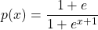
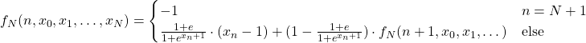
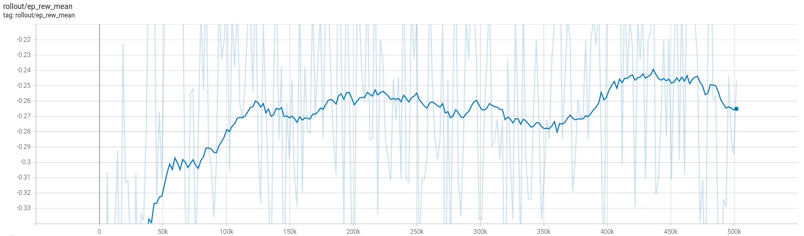

This repository contains a PIP package which is an OpenAI environment for
simulating an enironment in which bananas get sold.


## Installation

Install the [OpenAI gym](https://gym.openai.com/docs/).

Then install this package via

```
pip install -e .
```

## Usage

```
import gym
import gym_banana

env = gym.make('Banana-v0')
```

See https://github.com/matthiasplappert/keras-rl/tree/master/examples for some
examples.


## The Environment

Imagine you are selling bananas. One at a time. And the bananas get bad pretty
quickly. Let's say in 3 days. The probability that I will sell the banana
is given by



where x-1 is my profit. This x-1 is my reward. If I don't sell the
banana, the agent gets a reward of -1 (the price of the banana).

## Example agent

See .

## Analytic solution

This recursive equation corresponds to the probability tree diagram. 
Prices on the n-th day are x_n.



Optimization in all x_i (eg. via a grid) allows to compare (at low N) the learned result with the analytic result (except for statistical fluctuations). 
See .

## Comparison



The mean reward is roughly the same as the analytic for N=2:

```
[1.5 1.1]  =>  -0.25655004382636204
```

This means highest reward on average is achieved by selling for 1.5 on the first day and 1.1 on the second.